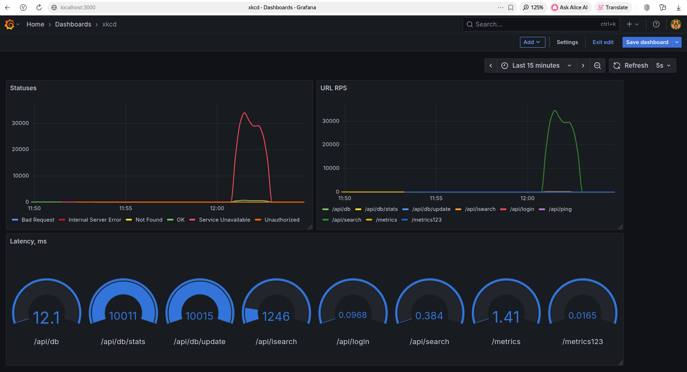

# Управление нагрузкой и доступом

## Цель

Ограничить нагрузку на сервис с помощью rate и concurrency limiters. Добавить контроль доступа
к критическим операциям.

В данном задании необходимо познакомиться с шаблоном Адаптер (middleware) в REST API.

Для endpoint-а /api/search, который ходит напрямую в базу данных, нужно добавить
concurrency limiter, заданный переменной окружения SEARCH_CONCURRENCY. При достижении лимита
на работу с данным endpoint-ом система должна возвращать HTTP статус 503 (service unavailable).

Для endpoint-а /api/isearch нужно добавить rate limiter, который регулируется переменной
окружения SEARCH_RATE. Данный limiter не возвращает 503, а задерживает соединения для регулировки
их скорости в пределах заданного переменной окружения RPS (requests per second).

Два критических endpoint-а должны быть защищены от доступа непривилегированными пользователями.
Доступ регулируется через 'POST /api/login' endpoint и middleware для проверки выданных логином
JWT токенов. "POST /api/login" должен принимать JSON в теле запроса вида

```json
{
  "name": "admin",
  "password": "password"
}
```

и отдавать токен ввиде строчки. Вам ненужно реализовывать отдельный микросервис авторизации -
достаточно принимать из переменных среды имя и пароль "суперпользователя", переменные
ADMIN_USER и ADMIN_PASSWORD. "/api/login" проверяет пользователя и пароль, и если они не совпадают,
отдаем HTTP Unauthorized. Если все ОК - выдаем токен на время TOKEN_TTL (переменная среды,
2 минуты по умолчанию) с subject установленным в "superuser". При запросах на обновление базы
или ее удаление, необходимо реализовать middleware, котрое будет выданный токен проверять -
HTTP Header вида "Authorization: Token выданный_токен_здесь". Если не удалось проверить токен -
HTTP Unauthorized.

Для тестирования search rate (endpoint isearch) предлагается использовать
[bombardier](https://github.com/codesenberg/bombardier) (make tools его установит):

``` bash
make tools
make up

TOKEN=$(curl -s -X POST -d '{"name": "admin", "password": "password"}' localhost:28080/api/login)

bombardier -H "Authorization: Token $TOKEN" 'localhost:28080/api/isearch?phrase=linux'
Bombarding http://localhost:28080/api/isearch?phrase=linux for 10s using 125 connection(s)
[========================================================================================] 10s
Done!
Statistics        Avg      Stdev        Max
  Reqs/sec       100.03       2.25     104.67
  Latency         1.18s   228.71ms      1.25s
  HTTP codes:
    1xx - 0, 2xx - 1125, 3xx - 0, 4xx - 0, 5xx - 0
    others - 0
  Throughput:   148.12KB/s

```

Как видно из примера запуска, по умолчанию мы "бомбардировали" isearch 125 клиентами в течение
10 секунд. Если запустить то же самое для search endpoint, то мы должны увидеть множество ошибок,
так как требуется возвращать HTTP status 503 для "лишних". В то же время для 10 клиентов не должно
быть ошибок, помним про search concurrency.

Предлагается сервис проверки и выдачи токенов реализовать в адаптере - это позволит потом плавно
перейти к разработке отдельного сервиса AAA (Authentication, Authorization, Accounting).

Для сбора метрик и мониторинга в этом задании предлагается познакомиться с VictoriaMetrics и
Grafana. VictoriaMetrics позволяет собирать метрики, хранить и делать различные аналитичекские
запросы, а Grafana удобно их отображает. VictoriaMetrics запущена по адресу <http://localhost:8428>
(внутри Docker сети - <http://victoriametrics:8428>), Grafana - <http://localhost:3000> .
Вам необходимо дополнить middleware для http.ServeMux, которое перехватывает запросы, измеряет их
время и сохраняет HTTP статус. Эти данные необходимо экспортировать через endpoint 'GET /metrics'
с помощью клиентской библиотеки VictoriaMetrics в виде Histogram http_request_duration_seconds.
Последняя преобразуется автоматически VictoriaMetrics клиентом в две - с суффиксом_total и _count.
У http_request_duration_seconds должны быть метки:

- status: HTTP статус в виде строчного представления
- url: endpoint вида '/api/search'

Сама метрика должна иметь значения секунд, прошедших с начала запроса.
Каркас middleware для метрик уже представлен в исходном коде. Также необходимо настроить Grafana:

1. Открыть <http://localhost:3000> , пользователь: admin, пароль: админ.
2. Открыть через основное меню "Плагины", установить плагин "VictoriaMetrics"
3. Добавить Datasource для VictoriaMetrics, адрес - <http://victoriametrics:8428> . В самом низу
страницы есть кнопка Test & Save, при нажатии ответ подсвечивается зеленым.
4. Добавить Dashboard из папки metrics, Dashboards->New->Import->Upload JSON.
5. Выбрать для xkcd дашборда 15 мин интервал и 5с обновление.

По мере работы с кластером данные будут обновляться и добавляться (в течение 1-2 минут). При сдаче
задания в Merge Request необходимо добавить в виде комментария скриншот с графиками Grafana после
запуска тестов через make run-tests.



Сервисы должны собираться и запускаться через модифицированный compose файл,
а также проходить интеграционные тесты - запуск специального тест контейнера.

## Критерии приемки

1. Микросервисы компилируются в docker image-ы, запускаются через compose файл и проходят тесты.
2. Можно использовать код из предыдущего задания.
3. Сервис api конфигурируeтся через cleanenv пакет и должeн уметь запускаться как с config.yaml
файлом через флаг -config, так и через переменные среды, в этом задании -
ADMIN_USER, ADMIN_PASSWORD, TOKEN_TTL, API_ADDRESS, WORDS_ADDRESS, UPDATE_ADDRESS,
SEARCH_ADDRESS, SEARCH_CONCURRENCY, SEARCH_RATE. Все они уже добавлены в compose.yaml.
4. Используется golang 1.25+, slog логгер.
5. Скриншот из Grafana в MR комментарии после запуска тестов "make run-tests.

## Материалы для ознакомления

Rate limiters:

- [System Design - ограничитель трафика](http://youtube.com/watch?v=w4suQQtnYmY)
- [Go rate limiter](https://github.com/uber-go/ratelimit)
- [x/time/rate](https://pkg.go.dev/golang.org/x/time/rate)

Middleware:

- [Logging middleware example](https://gowebexamples.com/basic-middleware/)
- [Разработка REST-серверов на Go. Часть 5: Middleware](https://habr.com/ru/companies/ruvds/articles/566198/)

JWT:

- [golang-jwt/jwt](https://pkg.go.dev/github.com/golang-jwt/jwt/v5)
- [A guide to JWT authentication in Go](https://blog.logrocket.com/jwt-authentication-go/)
- [JWT-авторизация на сервере](https://ru.hexlet.io/courses/go-web-development/lessons/auth/theory_unit)

VictoriaMetrics:

- [Concepts](https://docs.victoriametrics.com/victoriametrics/keyconcepts/)
- [Golang library](https://pkg.go.dev/github.com/VictoriaMetrics/metrics)
- [Sample code](https://github.com/VictoriaMetrics/metrics/blob/master/histogram_example_test.go)
