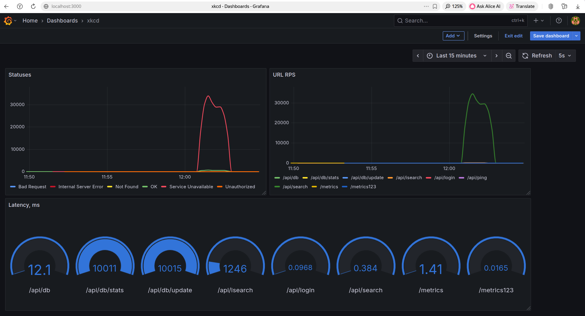

<div align="center">
  <h1>XKCD Search</h1>
  <p>Микросервисный поиск по комиксам XKCD на Go</p>

  <p>
    <a href="https://github.com/marlendd/XKCD-Search/actions/workflows/ci.yml"></a>
    
    
    
    
  </p>
</div>

XKCD Search загружает комиксы с [xkcd.com](https://xkcd.com), нормализует текст и позволяет искать по нему обычным или индексным поиском. Проект демонстрирует взаимодействие Go-микросервисов через REST, gRPC и NATS, работу с PostgreSQL, JWT-авторизацию, метрики и развёртывание в Kubernetes.

## Возможности

- обычный и индексный полнотекстовый поиск по комиксам;
- фоновая синхронизация с XKCD API;
- нормализация и Snowball-стемминг поисковых фраз;
- REST API поверх внутренних gRPC-сервисов;
- JWT-авторизация для административных операций;
- concurrency limiter и leaky-bucket rate limiter;
- событийное обновление поискового индекса через NATS;
- метрики для VictoriaMetrics и готовый Grafana dashboard;
- Docker Compose для локального запуска;
- Kubernetes-манифесты с probes, ресурсами, HPA и постоянным томом PostgreSQL;
- unit- и интеграционные тесты, CI-пайплайн `lint → build → test`.

## Архитектура

```text
Browser
   │ HTTP
   ▼
frontend (BFF)
   │ HTTP
   ▼
api (REST gateway)
   ├── gRPC ──► words
   ├── gRPC ──► update ── SQL ──► PostgreSQL
   │               ├── gRPC ──► words
   │               ├── HTTP ──► xkcd.com
   │               └── publish ──► NATS
   └── gRPC ──► search ── SQL ──► PostgreSQL
                   ├── gRPC ──► words
                   └── subscribe ──► NATS
```

| Компонент | Назначение | Протокол |
|---|---|---|
| `frontend` | Web-интерфейс и BFF для браузера | HTTP |
| `api` | REST gateway, авторизация и middleware | HTTP / gRPC |
| `update` | Загрузка комиксов и миграции базы | gRPC |
| `search` | Обычный и индексный поиск | gRPC |
| `words` | Нормализация и стемминг текста | gRPC |
| `postgres` | Постоянное хранение комиксов | PostgreSQL |
| `nats` | События обновления и очистки индекса | NATS |

## Быстрый запуск

Понадобятся Docker и Docker Compose.

1. Создайте локальную конфигурацию:

   ```bash
   cp .env.example .env
   ```

2. Замените демонстрационные пароли и `JWT_SECRET` в `.env`.

3. Соберите и запустите проект:

   ```bash
   docker compose up --build --detach
   ```

4. Проверьте состояние сервисов:

   ```bash
   docker compose ps
   curl http://localhost:28080/api/ping
   ```

Остановить проект:

```bash
docker compose down
```

Удалить контейнеры вместе с локальными данными PostgreSQL, Grafana и VictoriaMetrics:

```bash
docker compose down --volumes
```

## Доступные интерфейсы

| Адрес | Назначение |
|---|---|
| <http://localhost:28084> | Web-интерфейс поиска |
| <http://localhost:28084/login> | Вход администратора |
| <http://localhost:28080/api/ping> | Проверка API и gRPC-сервисов |
| <http://localhost:3000> | Grafana |
| <http://localhost:8428> | VictoriaMetrics |
| <http://localhost:18888> | pgAdmin |

Данные администратора и pgAdmin задаются в `.env`. При первом входе в Grafana используются стандартные `admin / admin`.

## Работа с API

Получите JWT-токен и запустите обновление базы:

```bash
set -a
source .env
set +a

TOKEN=$(curl --silent --request POST \
  --header "Content-Type: application/json" \
  --data "{\"name\":\"$ADMIN_USER\",\"password\":\"$ADMIN_PASSWORD\"}" \
  http://localhost:28080/api/login)

curl --request POST \
  --header "Authorization: Token $TOKEN" \
  http://localhost:28080/api/db/update
```

После загрузки данных выполните поиск:

```bash
curl "http://localhost:28080/api/search?phrase=linux&limit=5"
curl "http://localhost:28080/api/isearch?phrase=linux&limit=5"
```

### REST endpoints

| Метод | Endpoint | Назначение | JWT |
|---|---|---|:---:|
| `GET` | `/api/ping` | Проверка внутренних сервисов | Нет |
| `POST` | `/api/login` | Получение JWT-токена | Нет |
| `GET` | `/api/search` | Поиск с ограничением concurrency | Нет |
| `GET` | `/api/isearch` | Индексный поиск с rate limit | Нет |
| `POST` | `/api/db/update` | Асинхронное обновление базы | Да |
| `DELETE` | `/api/db` | Очистка базы | Да |
| `GET` | `/api/db/stats` | Статистика базы | Нет |
| `GET` | `/api/db/status` | Статус обновления | Нет |
| `GET` | `/metrics` | Метрики приложения | Нет |

JWT передаётся в заголовке `Authorization: Token <token>`. Срок действия задаётся через `TOKEN_TTL`, подпись создаётся алгоритмом HS256 с ключом `JWT_SECRET`.

## Kubernetes

В каталоге [`k8s`](k8s/README.md) находится готовое локальное развёртывание для Minikube:

- `Deployment` для Go-сервисов и NATS;
- `StatefulSet` и `PersistentVolumeClaim` для PostgreSQL;
- `Service` и внутренний DNS между компонентами;
- `ConfigMap` и отдельные Kubernetes Secrets;
- startup, readiness и liveness probes;
- requests, limits и HPA для `words`;
- `NodePort` для frontend;
- Kustomize для применения всего набора.

После выполнения инструкции из [`k8s/README.md`](k8s/README.md) приложение открывается командой:

```bash
minikube service frontend --namespace xkcd --profile xkcd
```

Сервисы корректно обрабатывают `SIGINT` и `SIGTERM`, поэтому Kubernetes может завершать Pod без аварийной остановки процесса.

## Middleware

`GET /api/search` ограничивает количество одновременно выполняемых запросов. При превышении `SEARCH_CONCURRENCY` API возвращает `503 Service Unavailable`.

`GET /api/isearch` использует leaky bucket и ограничивает скорость через `SEARCH_RATE`. Лишние запросы ожидают своей очереди вместо немедленного отказа.

Защищённые endpoints проходят JWT middleware. Metrics middleware измеряет длительность и статус каждого HTTP-запроса и экспортирует histogram `http_request_duration_seconds`.

## Мониторинг

VictoriaMetrics собирает метрики API, а Grafana отображает RPS, HTTP-статусы и latency. Готовый dashboard находится в [`metrics/dashboard.json`](metrics/dashboard.json).



После запуска Docker Compose добавьте `http://victoriametrics:8428` как Prometheus datasource в Grafana и импортируйте dashboard.

## Разработка и тесты

Основные команды:

```bash
make unit    # unit-тесты сервисов и HTML-отчёт покрытия
make lint    # golangci-lint и protolint
make test    # полный интеграционный прогон через Docker Compose
```

`make test` пересоздаёт Compose-окружение и удаляет его volumes до и после тестов. Не запускайте эту команду, если в локальной PostgreSQL есть нужные данные.

Проверить Go-модули вручную:

```bash
(cd search-services && go test ./... && go vet ./...)
(cd tests && go test -run '^$' ./... && go vet ./...)
```

## Структура репозитория

```text
.
├── .github/workflows/ci.yml   # lint → build → test
├── k8s/                       # Minikube и Kustomize
├── metrics/                   # VictoriaMetrics и Grafana dashboard
├── search-services/
│   ├── api/                   # REST gateway
│   ├── frontend/              # web-интерфейс
│   ├── search/                # поисковый сервис
│   ├── update/                # синхронизация с XKCD
│   ├── words/                 # нормализация текста
│   └── proto/                 # protobuf-контракты
├── tests/                     # интеграционные тесты
├── compose.yaml
└── Makefile
```

## Технологии

Go 1.25 · REST · gRPC · Protocol Buffers · PostgreSQL 18 · NATS · JWT · VictoriaMetrics · Grafana · Docker Compose · Kubernetes · Minikube · Kustomize
